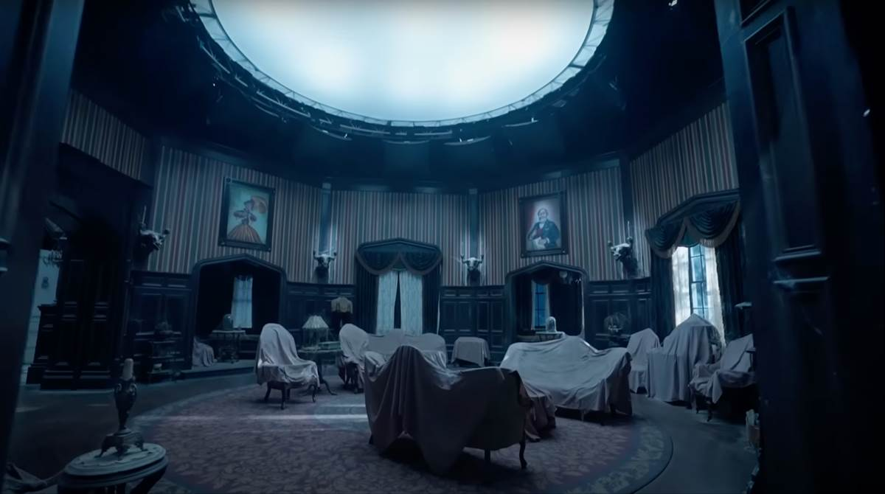

# 🏚️ Dark Mansion Adventure

Dark Mansion Adventure is an interactive text-based horror game built using Python and Tkinter. The game immerses players in a mysterious mansion filled with eerie surprises, hidden secrets, and multiple paths to escape. 👻

## ✨ Features
- **📖 Interactive Storytelling**: Make choices that shape your adventure.
- **🖼️ Dynamic UI**: Fullscreen background images with overlay text and buttons.
- **🎒 Inventory System**: Collect and use items to solve puzzles.
- **🔀 Multiple Endings**: Different choices lead to different fates.
- **🚪 Escape Options**: Break the curse, find the hidden exit, or get trapped forever.

## 📥 Installation
### Prerequisites
Ensure you have **Python 3.x** installed on your system.

Install required dependencies:
```sh
pip install pillow
```

### ⚙️ Setup
1. 📂 Clone this repository or download the source files.
2. 🖼️ Ensure your project folder has an `assets` directory containing the following images:
   - `dark_room.jpg`
   - `left_room.jpg`
   - `mirror_hall.jpg`
   - `secret_passage.jpg`
   - `mirror_world.jpg`
3. ▶️ Run the Python script:
```sh
python task1.py
```

## 🎮 Controls
- 🖱️ Click the buttons to make choices.
- ⎋ Press **ESC** to exit fullscreen mode.

## 🏰 Game Structure
- **🚪 Left Door Path**: Leads to a mysterious study with puzzles to solve.
- **🪞 Right Door Path**: Takes you to a haunted mirror hall with dark reflections.
- **🔒 Secret Passage**: A hidden path with chilling encounters.
- **🎒 Inventory Usage**: Items help you unlock secrets and change the game's outcome.

## 📸 Screenshots
 *(Example of in-game background)*

## 🤝 Contributions
Feel free to fork this project, report issues, or suggest new features! 🚀

---
**Enjoy your adventure in the Dark Mansion! 🕯️**

